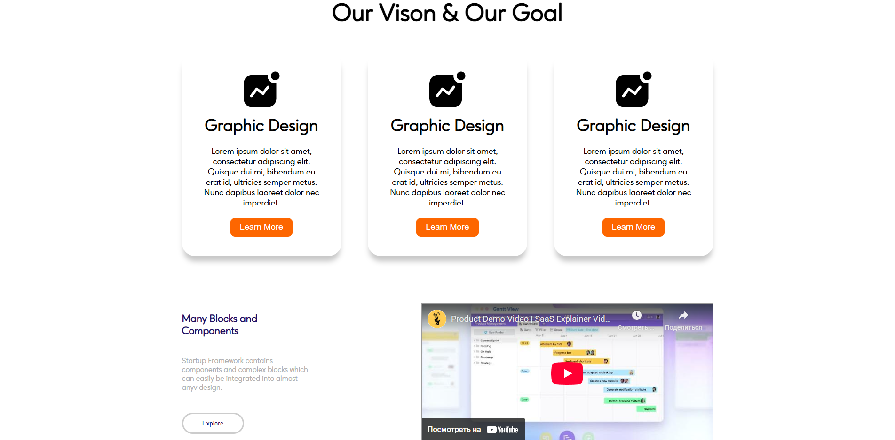

# Epixelab Website

This project is a website built based on a **Figma design**.  
It was created for learning and practice purposes using HTML, CSS, and a bit of JavaScript.

**A responsive and clean web page built entirely with pure CSS.**
## 🌐 Live Demo
You can view the website here:  
👉 [Epixelab Live](https://meruj2333.github.io/epixelab/)

---

## About the Project

✅ Built 100% with **custom CSS**  
✅ Fully responsive and beginner-friendly  
✅ Great reference for clean layout and HTML/CSS structure

---

## Demo Screenshot

---

## ✨ Features
- Layout implemented from Figma design
- Responsive design (works on different screen sizes)
- Small JavaScript functionality
- Main sections: Home, About, Our App, Contacts

## 🛠 Technologies Used
- **HTML5**
- **CSS3**
- **JavaScript**
- **GitHub Pages** (for deployment)

## 🚀 Future Improvements
- Replace placeholder images and lorem ipsum text with real content
- Add more interactivity (animations, scroll effects, etc.)
- Improve the overall design

## 👤 Author
- **Meruj Harutyunyan**
- 💻 GitHub: [meruj2333](https://github.com/meruj2333)
-   🔗 LinkedIn: [My LinkedIn Profile](https://www.linkedin.com/in/meruj-harutyunyan-80b52135b/)
